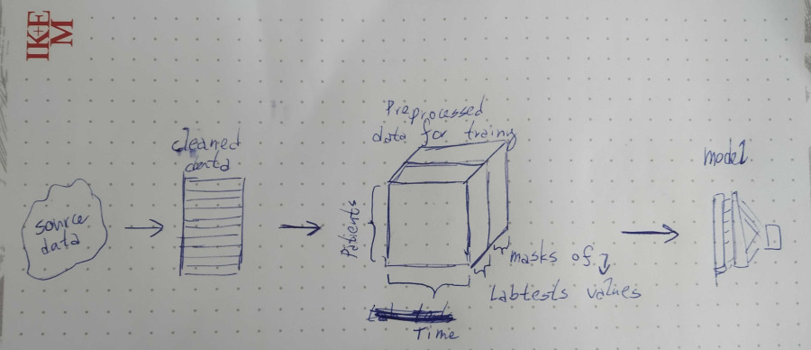

# Revolt BI Hack

This repository contains a source to recreate our deep learning model
that detects N18 diagnosis from laboratory data.

# What we have achieved:

TODO

# Structure of the repository

* XXX TODO: Initial scripts
* preprocessing_pivoting.ipynb - Jupyter Notebook for preprocessing in final form that is used for training
* targets.ipynb - Jupyter notebook for creating a file that finds patients with diagnose that we are searching for
* train.py - The main script that creates model and perform the training and validation
* inspect.py - The script for computation of gradients of model to get some insight into the model
* inspect_analysis.ipynb - Visualization of gradients of input features

# Dependencies

* Tensorflow, Numpy, Pandas

# Dataprocessing pipeline

